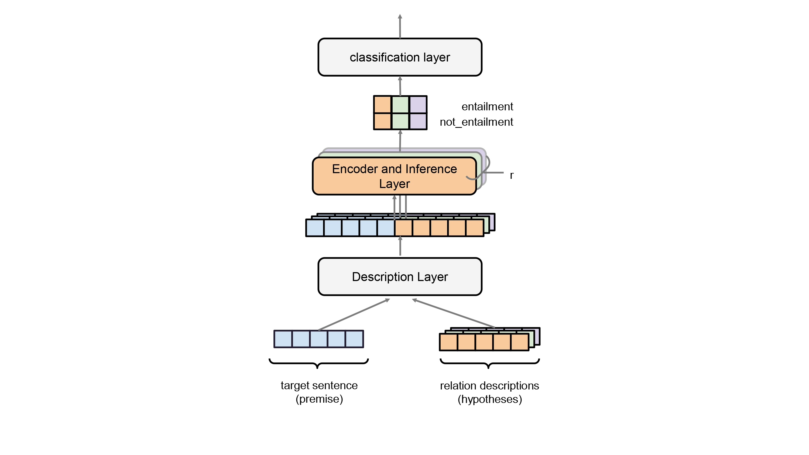

# level1
## level2.
#### level3.




```python

if __name__ == "__main__":
    parser = ArgumentParser()
    parser.add_argument("--pretrain_data", type=str, default="./data/cnn.txt", \
                        help="pre-training data .txt file path")
    parser.add_argument("--batch_size", type=int, default=32, help="Training batch size")

```


[paperwithcode](https://paperswithcode.com/)

[github](https://github.com/)

[jump to linker.md](linker.md)


> quote.


**bolded text**

*italicized text*

~~strikethrough text~~

bulleted list.
* first
* second
* third

numbered list.
1. first:
    - a
    - b
2. second：
    - a
    - b

| tabel | colum1 | colum2| colum3|
| :-----| :----:| :----: | :----: |
| row1 | 单元格 | 单元格 | 单元格 |
| row2| 单元格 | 单元格 | 单元格 |
| row3 | 单元格 | 单元格 | 单元格 |


***
